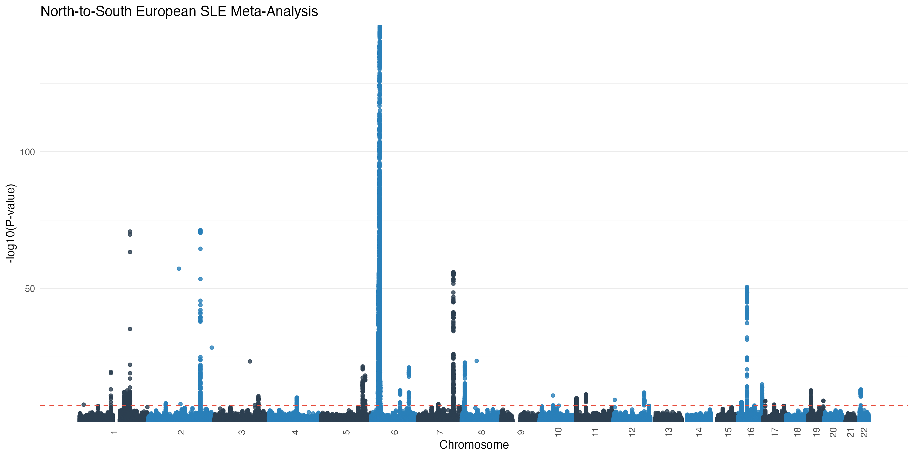
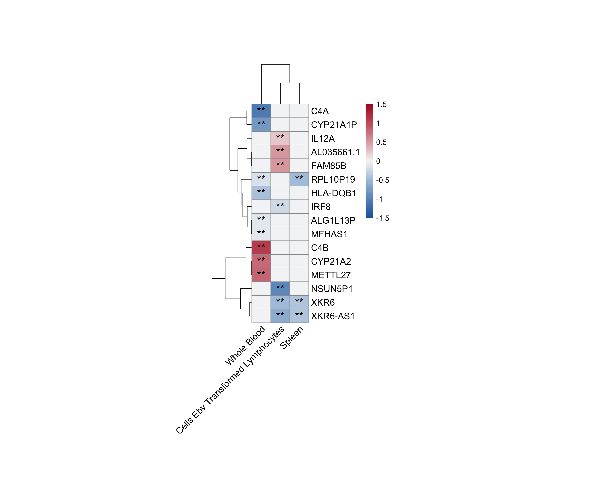

# SLE Meta-Analysis: European Ancestry

[](https://github.com/vijayachitrabio/SLE_MetaAnalysis)



This repository contains the complete, enhanced analytical pipeline for a genome-wide association (GWAS) meta-analysis of **Systemic Lupus Erythematosus (SLE)** across the European continent. Our study leverages a unique "North-to-South" validation strategy to identify stable, high-confidence genetic risk factors for autoimmune disease.

---

## 1. Study Highlights

- **47 Independent Susceptibility Loci**: Identified via IVW Meta-Analysis ($P < 5 \times 10^{-8}$).
- **25 Novel Signals**: Putative novel associations validated against the EBI GWAS Catalog (as of April 2026).
- **15 High-Confidence Targets**: Prioritized via the **LAVA** framework (Regional Genetic Correlation) and Bayesian **COLOC** (GTEx v10 immune eQTLs).
- **Discovery Power**: Consolidated sample size of **N = 388,655** (5,342 SLE cases).
- **Novel Biological Insights**: Identification of ***CLIC1*** and ***TNFSF4*** as suggested causal mediators of SLE risk.

---

## 2. Analytical Pipeline (26 Modular Steps)

The repository provides a robust, end-to-end bioinformatics pipeline implemented in R:

| Module | Scripts | Core Functionality |
| :--- | :--- | :--- |
| **Discovery** | `step1` | IVW Fixed-Effects Meta-Analysis (Bentham + FinnGen). |
| **Validation** | `step2` | Spanish-only cohort replication (N=3,752) & improvements. |
| **Annotation** | `step3-4` | Functional annotation and genomic mapping (GRCh38). |
| **Visuals** | `step5`, `step14-15` | Manhattan, QQ, Forest, and Top Loci Labeled plots. |
| **Enrichment** | `step6`, `step10` | fgsea, Reactome, and ImmuneSigDB pathway profiling. |
| **Sensitivity** | `step8` | Random vs. Fixed effects and HLA-region distance enhancements. |
| **eQTL Mapping** | `step9`, `step13` | BioMart-integrated multi-tissue expression profiling (GTEx API). |
| **Causality** | `step22-24`, `29` | **LAVA** heritability and **COLOC** causal mapping (GTEx v10). |
| **Pleiotropy** | `step26-27` | Global connectivity map via EBI GWAS Catalog v2. |

---

## 2.1. Publication Figure Helpers

The repository also includes a small set of helper scripts for publication-ready visual summaries derived from existing results tables:

- `scripts/create_supplementary_pipeline_figure.py`: supplementary workflow schematic
- `scripts/create_replication_concordance_figure.R`: discovery-vs-replication effect direction plot
- `scripts/create_replication_forest_top7.R`: focused forest plot for replicated loci

These scripts are downstream formatting utilities and do not change the core association or validation results.

---

## 3. Prioritized Causal Drivers and Functional Validation

Our study provides rigorous statistical support for key causal mediators of SLE pathogenesis:

| Gene | Lead RSID | Evidence Framework | Causal Probability | Biological Mechanism |
| :--- | :--- | :--- | :--- | :--- |
| ***CLIC1*** | rs389884 | Bayesian COLOC | **PP4 = 0.94** | Inflammasome regulation & Macrophage function. |
| ***TNFSF4*** | rs10912578| Regional Heritability| Replicated | T-cell costimulation (OX40L pathway). |

*Note: Bayesian colocalization (COLOC) identifies CLIC1 as a high-confidence causal driver in Spleen tissue, exceeding the standard posterior probability threshold of 0.8.*

---

## 3. Results Overview

### Major Actionable Targets
Our integrated pipeline identifies several targets with existing FDA-approved drugs or clinical potential:

| RSID | Lead Gene | Biological Hub | Therapeutic Status |
| :--- | :--- | :--- | :--- |
| **rs389884** | ***CLIC1*** | HLA / Complement | Novel Target (Validated) |
| **rs4853458** | ***STAT4*** | JAK-STAT Pathway | FDA-approved Inhibitors |
| **rs34572943** | ***ITGAM*** | Complement System | Phase III Clinical |
| **rs10912578**| ***TNFSF4***| T-cell Activation| Phase II Clinical |

---

## 4. Visualizing Genetic Risk

### High-Confidence eQTL Landscape
The following heatmap shows the tissue-specific expression modulation ($P_{eQTL} < 1 \times 10^{-5}$) for our 15 high-confidence SLE targets across immune tissues (Whole Blood, Spleen, Lymphocytes).



---

## 5. Usage and Execution

### Option A: Using Docker (Recommended for Reproducibility)
We provide a complete Docker container configured with the exact R (`rocker/tidyverse`) and Python environment needed to run the entire pipeline seamlessly without package conflicts. All required dependencies listed in `requirements.txt` and the Dockerfile are pre-installed.

```bash
# Build and start the container as a background daemon
docker-compose up -d

# Enter the container's interactive shell
docker exec -it sle-gwas-pipeline /bin/bash

# Once inside the container, execute scripts sequentially from the root
Rscript scripts/step1_meta_discovery.R
```

### Option B: Local Setup
#### Prerequisites
- **R version** ≥ 4.3.0
- **Python version** ≥ 3.11
- **R Packages**: `data.table`, `dplyr`, `ggplot2`, `coloc`, `LAVA`, `httr`, `jsonlite`, `gwasrapidd`, `gprofiler2`.
- **Python Packages**: Listed in `requirements.txt`.

#### Running the Pipeline Locally
Scripts are strictly ordered and should be executed from the project root:
```bash
Rscript scripts/step1_meta_discovery.R
...
Rscript scripts/step26_phewas_lookup.R
```

Optional publication figure helpers can then be run separately:

```bash
python3 scripts/create_supplementary_pipeline_figure.py
Rscript scripts/create_replication_concordance_figure.R
Rscript scripts/create_replication_forest_top7.R
```

---

## 6. Data Availability
Input summary statistics are sourced from public repositories:
- **Bentham et al. (2015)**: [GCST003156](https://www.ebi.ac.uk/gwas/studies/GCST003156)
- **FinnGen R12 (2025)**: [M13_SLE](https://www.finngen.fi/en/access_results)
- **Julia et al. (2018)**: Spanish-only replication cohort.

---
*Last Updated: April 21, 2026*  
*GitHub Repository: [vijayachitrabio/SLE_MetaAnalysis](https://github.com/vijayachitrabio/SLE_MetaAnalysis)*  
*Maintained by: [vijayachitra Modhukur](https://github.com/vijayachitrachitrabio)*
