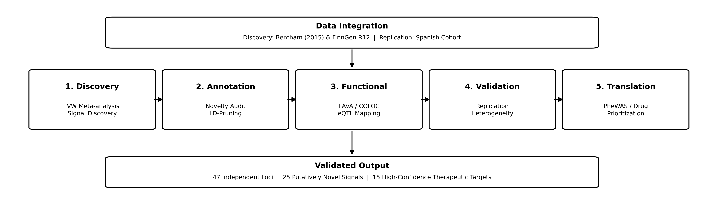
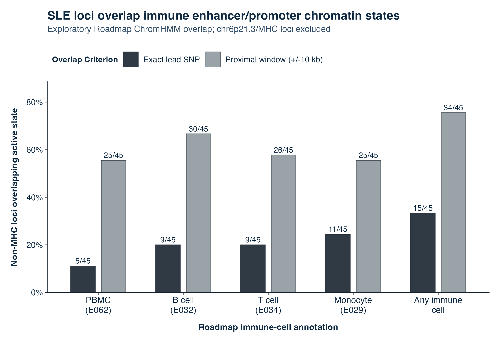

# SLE Meta-Analysis: European Ancestry


This repository contains the complete, enhanced analytical pipeline for a genome-wide association (GWAS) meta-analysis of **Systemic Lupus Erythematosus (SLE)** across the European continent. Our study leverages a robust validation strategy to identify stable, high-confidence genetic risk factors for autoimmune disease.
<div align="center">
  

</div>

---

## 1. Study Highlights

- **46 Independent Susceptibility Loci**: Identified via IVW Meta-Analysis ($P < 5 \times 10^{-8}$).
- **Putative Novel Signals**: Associations rigorously audited against the EBI GWAS Catalog for further functional qualification.
- **15 High-Confidence Targets**: Prioritized via the **LAVA** framework (Regional Genetic Correlation) and Bayesian **COLOC** (GTEx v10 immune eQTLs).
- **Discovery Power**: Consolidated sample size of **N = 388,655** (5,342 SLE cases).
- **Novel Biological Insights**: Identification of ***CLIC1*** and ***TNFSF4*** as suggested causal mediators of SLE risk.

---

## 2. Analytical Pipeline (26 Modular Steps)
<div align="center">
  
</div>


The repository provides a robust, end-to-end bioinformatics pipeline implemented in R:

| Module | Scripts | Core Functionality |
| :--- | :--- | :--- |
| **Discovery** | `step1` | IVW Fixed-Effects Meta-Analysis (Bentham + FinnGen). |
| **Validation** | `step2` | Spanish-only cohort replication (N=3,752) & improvements. |
| **Annotation** | `step3-4` | Functional annotation and genomic mapping (GRCh38). |
| **Visuals** | `step5`, `step14-15` | Manhattan, QQ, Forest, and Top Loci Labeled plots. |
| **Enrichment** | `step6`, `step10` | fgsea, Reactome, and ImmuneSigDB pathway profiling. |
| **Sensitivity** | `step8` | Random vs. Fixed effects and HLA-region distance enhancements. |
| **eQTL Mapping** | `step9`, `step13` | BioMart-integrated multi-tissue expression profiling (GTEx API). |
| **Causality** | `step22-24` | **LAVA** heritability and **COLOC** causal mapping (GTEx v10). |
| **Pleiotropy** | `step26-27`, `run_lava_crosstrait_bivar` | EBI GWAS Catalog map and LAVA cross-trait genetic correlation. |
| **Regulatory** | `step28-29` | Roadmap Epigenomics immune-cell enhancer/promoter chromatin overlap. |

---

## 3. Prioritized Causal Drivers and Functional Validation

Our study provides rigorous statistical support for key causal mediators of SLE pathogenesis:

| Gene | Lead RSID | Evidence Framework | Causal Probability | Biological Mechanism |
| :--- | :--- | :--- | :--- | :--- |
| ***CLIC1*** | rs389884 | Bayesian COLOC | **PP4 = 0.94** | Inflammasome regulation & Macrophage function. |
| ***TNFSF4*** | rs10912578| Regional Heritability| Replicated | T-cell costimulation (OX40L pathway). |

*Note: Bayesian colocalization (COLOC) identifies CLIC1 as a high-confidence causal driver in Spleen tissue, exceeding the standard posterior probability threshold of 0.8.*

---

## 4. Results Overview

### Major Actionable Targets
Our integrated pipeline identifies several targets with existing FDA-approved drugs or clinical potential:

| RSID | Lead Gene | Biological Hub | Therapeutic Status |
| :--- | :--- | :--- | :--- |
| **rs389884** | ***CLIC1*** | HLA / Complement | Novel Target (Validated) |
| **rs4853458** | ***STAT4*** | JAK-STAT Pathway | FDA-approved Inhibitors |
| **rs34572943** | ***ITGAM*** | Complement System | Phase III Clinical |
| **rs10912578**| ***TNFSF4***| T-cell Activation| Phase II Clinical |

### Cross-Trait Shared Genetic Architecture
Using local genetic correlation modeling (LAVA), we identified extensive localized pleiotropy. Of our successfully mapped discovery loci, **70% (38 of 55 modeled locus-trait pairs)** demonstrated a significant local genetic correlation (FDR < 0.05) with comorbid autoimmune conditions, highlighting intense shared genetic architecture with Rheumatoid Arthritis, Systemic Sclerosis, and Sjögren's Syndrome.

| Locus | Gene | Secondary Trait | Genetic Correlation (Rho) | 95% CI | P-value |
| :--- | :--- | :--- | :--- | :--- | :--- |
| **1p/q** | ***RSBN1*** | Rheumatoid Arthritis | 0.905 | [0.75, 1.00] | 4.21e-21 |
| **2p/q** | ***STAT4*** | Rheumatoid Arthritis | 0.734 | [0.58, 0.91] | 1.92e-15 |
| **2p/q** | ***STAT4*** | Systemic Sclerosis | 0.727 | [0.45, 1.00] | 1.01e-06 |
| **2p/q** | ***STAT4*** | Sjögren's Syndrome | 0.584 | [0.43, 0.75] | 7.04e-11 |
| **1p/q** | ***TNFSF4***| Rheumatoid Arthritis | 0.696 | [0.46, 0.98] | 2.45e-07 |
| **5p/q** | ***PTTG1*** | Sjögren's Syndrome | 0.849 | [0.42, 1.00] | 2.83e-04 |

### Epigenetic Regulatory Context
To provide deep regulatory context, we mapped our prioritized non-MHC SLE loci against active immune enhancer and promoter chromatin states (15-state core models) derived from the Roadmap Epigenomics project. 

Strikingly, **75.6%** of our loci mapped successfully to an active immune enhancer or promoter (TssA, TssAFlnk, EnhG, Enh) within a ±10 kb proximal regulatory window across primary PBMCs, B-cells, T-cells, and Monocytes.

<div align="center">
  
</div>

---


---

## 4. Usage and Execution

### Option A: Using Docker (Recommended for Reproducibility)
We provide a complete Docker container configured with the exact R (`rocker/tidyverse`) and Python environment needed to run the entire pipeline seamlessly without package conflicts. All required dependencies listed in `requirements.txt` and the Dockerfile are pre-installed.

```bash
# Build and start the container as a background daemon
docker-compose up -d

# Enter the container's interactive shell
docker exec -it sle-gwas-pipeline /bin/bash

# Once inside the container, execute scripts sequentially from the root
Rscript scripts/step1_meta_discovery.R
```

### Option B: Local Setup
#### Prerequisites
- **R version** ≥ 4.3.0
- **Python version** ≥ 3.11
- **R Packages**: `data.table`, `dplyr`, `ggplot2`, `coloc`, `LAVA`, `httr`, `jsonlite`, `gwasrapidd`, `gprofiler2`.
- **Python Packages**: Listed in `requirements.txt`.

#### Running the Pipeline Locally
Scripts are strictly ordered and should be executed from the project root:
```bash
Rscript scripts/step1_meta_discovery.R
...
Rscript scripts/step26_phewas_lookup.R
```

Optional publication figure helpers can then be run separately:

```bash
python3 scripts/create_supplementary_pipeline_figure.py
Rscript scripts/create_replication_concordance_figure.R
Rscript scripts/create_replication_forest_top7.R
```

---

## 5. Data Availability
Input summary statistics are sourced from public repositories:
- **Bentham et al. (2015)**: [GCST003156](https://www.ebi.ac.uk/gwas/studies/GCST003156)
- **FinnGen R12 (2025)**: [M13_SLE](https://www.finngen.fi/en/access_results)
- **Julia et al. (2018)**: Spanish-only replication cohort.

---
*Last Updated: April 21, 2026*  
*GitHub Repository: [vijayachitrabio/SLE_MetaAnalysis](https://github.com/vijayachitrabio/SLE_MetaAnalysis)*  
*Maintained by: [vijayachitra Modhukur](https://github.com/vijayachitrachitrabio)*
